# Docker技术文档

这是关于docker虚拟化技术的文档。旨在用于给初学者快速搭建docker环境以及学习相关知识。<br/>

- Windows/Mac OS/CentOS
- Docker
- Tomcat
- MySQL
- Nginx
- 等等

## 名词解释
#### 什么是虚拟化技术？

虚拟化技术是一个通用的概念。在计算领域，一般指的是计算虚拟化，或者通常说的服务器虚拟化。

维基百科的定义如下：

> 在计算机技术中，虚拟化(Virtualization)是一种资源管理技术，是将计算机的各种实体资源，如服务器、网络、内存以及存储等，予以抽象、转换后呈现出来，打破实体结构间的不可切割的障碍，使用户可以用比原来的组态更好的方式来应用这些资源。  

从大类上分，虚拟化技术可分为基于硬件的虚拟化和基于软件的虚拟化。我们常用的是基于软件的虚拟化。

基于软件的虚拟化从对象所在层次，又可以分为应用虚拟化和平台虚拟化。其中前者是指一些模拟器设备软件。后者又可以细分为如下几个子类：

* 完全虚拟化
* 硬件辅助虚拟化
* 部分虚拟化
* 超虚拟化
* 操作系统级虚拟化

本文档所指的Docker虚拟化，就是属于操作系统级虚拟化的技术范畴。

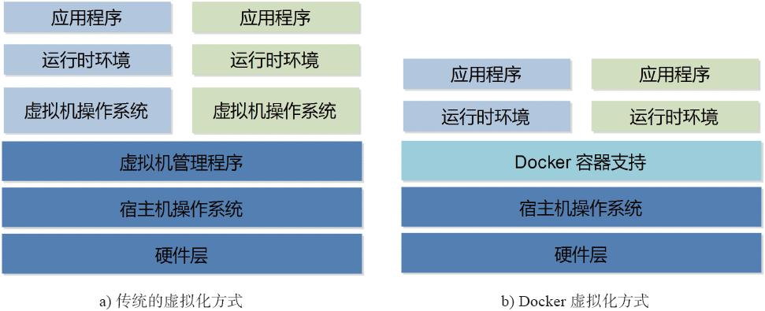


#### 什么是Docker?

Docker是基于GO语言实现的云开源项目，诞生于2013年初，最初的发起者是dotCloud公司。 

现在主流的Linux操作系统都已经支持Docker。例如，RedHat RHEL、CentOS,Ubuntu等操作系统，都已经默认带有Docker软件包。(受版本问题，可能有些低版本的操作系统，需要自行安装)。

Docker的主要目标是“Build Ship and Run Any App,Anywhere”，即通过对应用组件的封装(Packaging)、分支(Distribution)、部署(Deployment)、运行(Runtime)等生命周期的管理，达到应用组件级别的“一次封装，到处运行”。

#### Linux容器技术

Docker引擎的基础是Linxu容器技术。IBM给出关于容器技术的准确描述：

> 容器有效地将由单个操作系统管理的资源划分到孤立的组中，以便更好地在孤立的组之间平衡有冲突的资源使用需求。与虚拟化相比，这样既不需要指令级模拟，也不需要即时编译。容器可以在核心CPU本地运行指令，而不需要任何专门的解释机制。此外，也避免了准虚拟化和系统调用替换中的复杂性。  

#### 如何理解Docker？

我们可以简单地将Docker容器理解为一种沙盒(SandBox)。每个容器内运行一个应用。不同的容器相互隔离，容器之间也可以建立通信机制。容器的创建和停止都十分快速，容器自身对资源的需求也十分有限，远低于虚拟机。

#### Docker在开发和运维中的优势

对开发和运维(DevOps)过程中，具有如下几个优势：

- 更快速的交付和部署
- 更高效的资源利用
- 更轻松的迁移和扩展
- 更简单的更新管理

#### Docker与虚拟机比较

* Docker容器很快，启动和停止可以在秒级实现，这相比传统的虚拟机方式要快很多。
* Docker容器对系统资源需求很少，一台主机上可以同时运行数千个Docker容器。
* Docker通过类似Git的操作来方便用户获取、分发和更新应用镜像，指令简明，学习成本较低。
* Docker通过DockerFile配置文件来支持灵活的自动化创建和部署机制，提高工作效率。

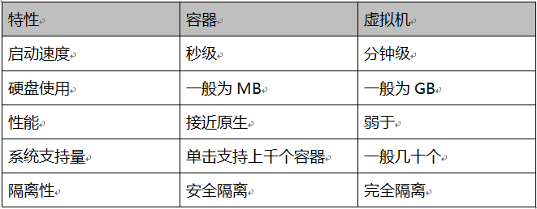

#### Docker不足

* LXC是基于cgroup等linux kernel功能的，因此container的guest系统只能是linux base的
* 隔离性相比KVM之类的虚拟化方案还是有些欠缺，所有container公用一部分的运行库
* 网络管理相对简单，主要是基于namespace隔离
* cgroup的cpu和cpuset提供的cpu功能相比KVM的等虚拟化方案相比难以度量(所以dotcloud主要是安内存收费)
* container随着用户进程的停止而销毁，container中的log等用户数据不便收集

### 总结

Docker是面向应用的，其终极目标是构建PAAS平台，而现有虚拟机主要目的是提供一个灵活的计算资源池，是面向架构的，其终极目标是构建一个IAAS平台，所以它不能替代传统虚拟化解决方案。目前在容器可管理性方面，对于方便运维，提供UI来管理监控各个containers的功能还不足，还都是第三方实现如DockerUI、Dockland、Shipyard等。

- - - -

## Docker的核心概念和安装

### Docker三大核心概念

* 镜像(Image)
* 容器(Container)
* 仓库(Repository)

#### Docker镜像

Docker镜像(Image)类似于虚拟机镜像，可以将它理解为一个面向Docker引擎的**只读**模板，包含了文件系统。

镜像是创建Docker容器的基础。通过版本管理和增量文件的文件系统，Docker提供了一套十分简单的机制来创建和更新现有的镜像，用户甚至可以从网上下载一个已经做好的应用镜像，并通过简单的命令就可以直接使用。

#### Docker容器

Docker容器(Container)类似于一个轻量级的沙箱，Docker利用容器来运行和隔离应用。

容器是从镜像创建的应用运行实例，可以将其启动、开始、停止、删除，而这些是相互隔离、互不可见。

镜像自身是只读的。容器从镜像启动的时候，Docker会在镜像的最上层创建一个可**读写层**，镜像本身将保持不变。

#### Docker仓库

Docker仓库(Repository)类似于代码仓库，是Docker集中存放镜像文件的场所。

注册服务器是存放仓库的地方，其上往往存放着多个仓库。每个仓库集中存放某一类镜像，往往包括多个镜像文件，通过不同的标签(tag)来进行区分。

如下图：

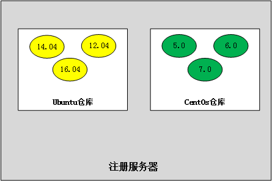

根据所存储的镜像公开分享与否，Docker仓库可以分为公开仓库(Public)和私有仓库(Private)两种形式。

目前，最大的公开仓库是Docker Hub，存放了数量庞大的镜像供用户下载。

在国内比较稳定的是阿里云仓库。

当用户创建了自己的镜像之后就可以使用push命令将它上传到指定的公有或私有仓库。这样用户下次在另外一台机器上使用该镜像时，只需将其从仓库上pull下拉就可以使用了。

- - - -
注意：*Docker利用仓库管理镜像的设计理念与Git非常相似。*
- - - -

#### Docker引擎

Docker引擎是一个客户端--服务器应用，由如下主要组件组成：

* 一个后台守护进程(daemon process.)
* 一个REST API 指定特定的接口，程序可以使用这些接口告诉和指导守护进程做什么.
* 一个命令行端口(CLI)，client.

如下图：


CLI使用Docker的REST API 来和Docker的守护进程交互，通过脚本或直接的CLI命令。

守护进程(daemon process)创建和管理Docker对象(objects).Docker对象包括镜像(images)、容器(containers)、网络(networks)、数据卷(data volumes)等等.

#### Docker架构

Docker使用客户端-服务器(client-server)架构. Docker client 告诉Docker daemon 建立、运行、和分发你你的Docker容器. Docker client和daemon可以运行在同一个系统中，或者可以使用Docker client 和远程的Docker  daemon 取得联系。docker客服端和docker守护进程之间通过sockets 或者REST API 交互。

如下图：

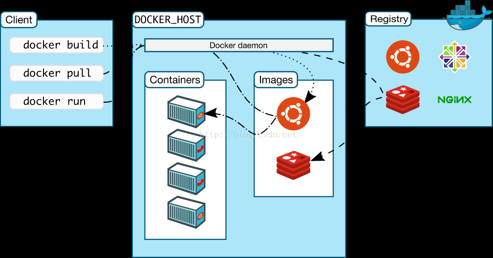

### 安装Docker

Docker支持在主流的操作系统平台上使用，包括Ubuntu、CentOS、Windows以及MacOS系统等。本文档主要讲解三个平台的安装，包括：CentOS,Windows以及MacOS系统。

#### CentOS

docker容器最早受到RHEL完善的支持是从最近的CentOS 7.0开始的，官方说明是只能运行于64位架构平台，内核版本为2.6.32-431及以上（即>=CentOS 6.5，运行docker时实际提示3.8.0及以上）。

需要注意的是CentOS 6.5与7.0的安装是有一点点不同的，CentOS-6上docker的安装包叫docker-io，并且来源于Fedora epel库，这个仓库维护了大量的没有包含在发行版中的软件，所以先要安装EPEL，而CentOS-7的docker直接包含在官方镜像源的Extras仓库（CentOS-Base.repo下的[extras]节enable=1启用）。前提是都需要联网，具体安装过程如下。

##### CentOS 6.5以上的安装

* 查看内核版本

```
# uname -r
2.6.32-431.el6.x86_64 
```

注意：必须要大于等于这个版本号

* 安装 Fedora EPEL

```
yum -y install http://dl.fedoraproject.org/pub/epel/6/x86_64/epel-release-6-8.noarch.rpm 
```

* 安装docker-io

```
# yum install docker-io
Dependencies Resolved

===========================================================================================
 Package                        Arch               Version          Repository     Size
===========================================================================================
Installing:
 docker-io                      x86_64         1.1.2-1.el6          epel          4.5 M
Installing for dependencies:
 lua-alt-getopt                 noarch         0.7.0-1.el6          epel          6.9 k
 lua-filesystem                 x86_64         1.4.2-1.el6          epel           24 k
 lua-lxc                        x86_64         1.0.6-1.el6          epel           15 k
 lxc                            x86_64         1.0.6-1.el6          epel          120 k
 lxc-libs                       x86_64         1.0.6-1.el6          epel          248 k

Transaction Summary
===========================================================================================
Install       6 Package(s)
```

* 启动Docker

```
# service docker start 
```

##### CentOS 7.0以上的安装

* 更新系统包到最新

```
# yum -y update
```

* 添加yum仓库

```
# cat >/etc/yum.repos.d/docker.repo <<-EOF
[dockerrepo]
name=Docker Repository
baseurl=https://yum.dockerproject.org/repo/main/centos/7
enabled=1
gpgcheck=1
gpgkey=https://yum.dockerproject.org/gpg
EOF
```

* 安装Docker包

```
yum install -y docker-engine
yum install -y docker-selinux
```

* 启动Docker

```
# systemctl start docker.service
```

* 设置Docker为开机自启动

```
#  systemctl enable docker.service
```

#### MacOS安装

* 下载Docker for Mac
* 安装即可

#### Windows安装

略

## 镜像
镜像是Docker的三大核心概念之一。

Docker运行容器前需要本地存在对应的镜像，如果镜像不存在本地，Docker会尝试从默认仓库下载（默认使用Docker Hub公共注册服务器中的仓库），用户也可以通过配置，使用自定义的镜像仓库。

本节内容将围绕着镜像这一核心概念的具体操作，包括如何使用pull命令从Docker仓库中下载镜像到本地；如何查看本地已有的镜像信息；如何在远端仓库使用search命令进行搜索和过滤；如何删除镜像标签和镜像文件；如何创建用户定制的镜像并且保存为外部文件等等。

#### 配置加速器

Docker默认下载镜像是通过默认仓库下载，其默认仓库是在国外的站点，在访问速度上比较慢，不稳定。为了改变这一情况，国内一些大的容器服务站点，例如：阿里云，daocloud等，提供了访问加速器。我们可以通过配置访问加速器，提高稳定性和下载速度。

##### 阿里云加速器

* 登录（阿里云开发平台）
* 进入管理中心
* 获得加速地址，如下图：

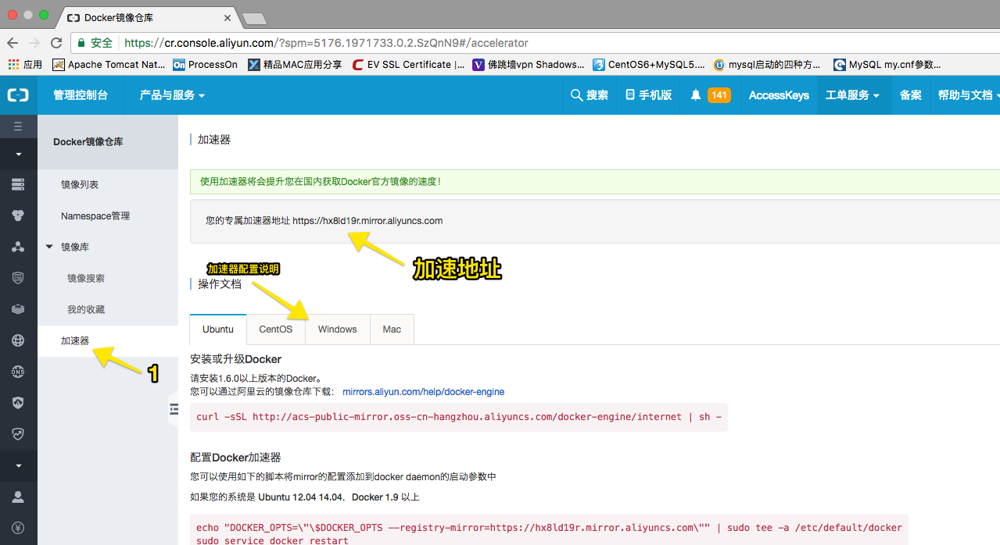

#### 获取镜像

镜像是Docker运行容器的前提。

可以使用**docker pull**命令从网络中下载镜像。该命令的格式为：

```
docker pull Name[:TAG]
```

如果不显示地指定TAG,则默认下载latest标签，即下载仓库中最新版本的镜像。

例如：

```
docker pull centos
```

该命令相当于从默认注册服务器(Registry.hub.docker.com)中的centOS仓库下载标记为latest的镜像。

```
docker pull docker pull registry.cn-hangzhou.aliyuncs.com/acs-sample/centos
```

该命令相当于从阿里云注册服务器(registry.cn-hangzhou.aliyuncs.com/acs-sample)中的centOS仓库下载标记为latest的镜像。

我们来看一下，下载过程，如下图：

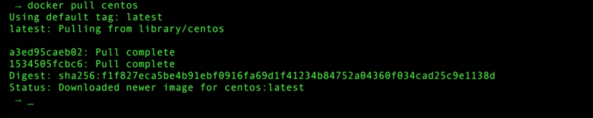

下载过程中可以看出，镜像文件一般是由若干层组成，首行a3ed95caeb92这样的字符串代表了各层的ID。下载过程中会获取并输出镜像的各层信息。层(Layer)其实是AUFS(高级联合文件系统)中的重要概念，是现实增量保存与更新的基础。

下载完成后，既可以使用该镜像了。例如：

```
docker run -ti centos /bin/bash
```

#### 查看镜像信息

使用**docker images**命令可以列出本地主机上已有的镜像。

例如：

```
docker images
```

如下图：

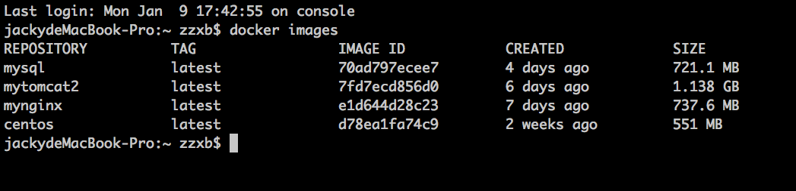

列出信息依次为：

* 来自于那个仓库
* 镜像的标签信息
* 镜像的ID号(唯一)
* 创建时间
* 镜像大小

其中镜像的ID信息十分重要，它唯一标识了镜像。

为了方便使用某个镜像，我们可以修改标签值，例如：

```
docker tag mysql mysql2
```

修改后，如下图：

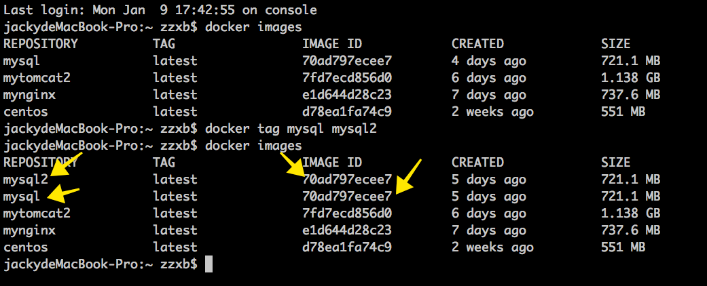

如上图，我们已经将mysql改为mysql2并创建了一个新的image，但是，这里要注意，mysql和mysql2其实实际上是一个镜像，只不过是同时指向了同一个镜像ID。

我们也可以使用，

```
docker rmi mysql2
```

删除它。如图：

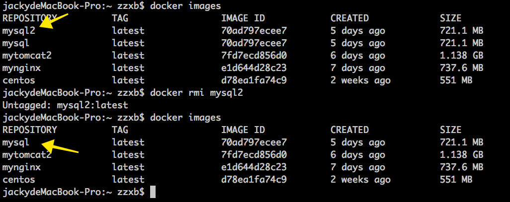

使用**docker inspect [镜像名]**命令可以获得该镜像的详细信息。

例如：

```
docker inspect mysql
```

如下图：

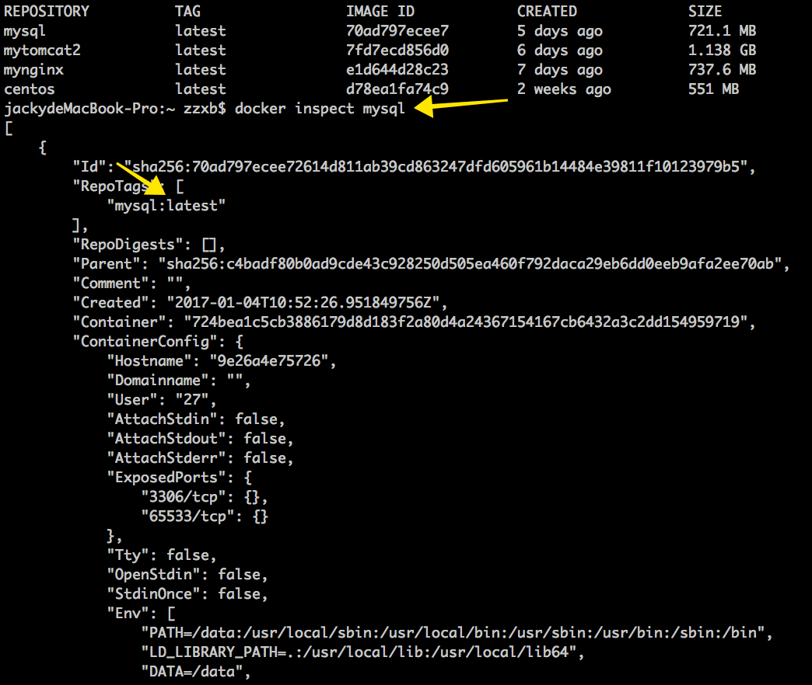

#### 搜寻镜像

使用**docker search**命令可以搜索远端仓库中共享的镜像，默认搜索Docker Hub官方仓库的镜像。

例如：

```
docker search centos
```

如下图：

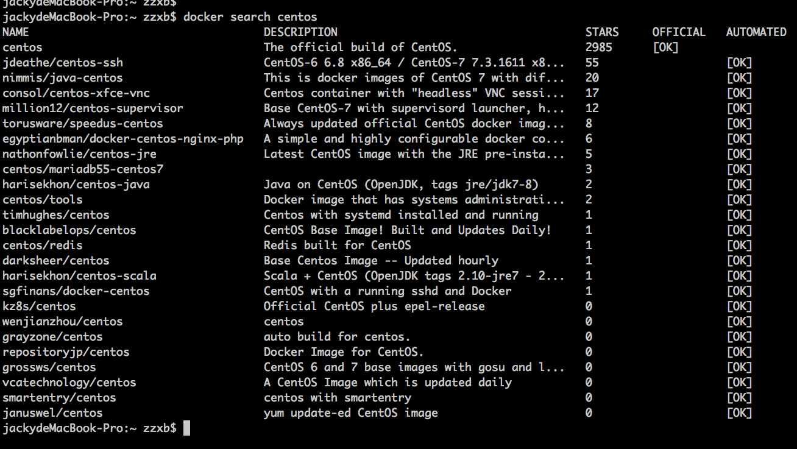

其实，我们还可以在阿里云容器服务站点中搜索

地址如下：https://dev.aliyun.com

#### 删除镜像

##### 使用镜像的标签删除镜像

命令格式如下：

```
docker rmi [IMAGE]
```

其中IMAGE可以是标签或ID

例如：

```
docker rmi mysql2
```

这条命令删除了该镜像多个标签中的一个指定标签而已，并不影响镜像文件。但是，当镜像只剩下一个标签的时候，就会彻底删除该镜像。

##### 使用镜像ID删除镜像

当使用**docker rmi**命令后面跟上镜像的ID时，会先尝试删除所有指向该镜像的标签，然后删除该镜像文件本身。

如下图：

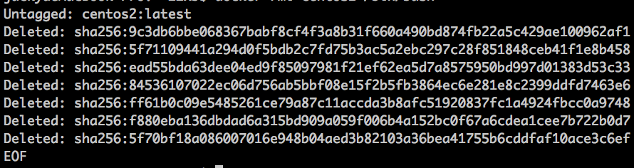

案例：

首先先运行镜像，创建一个简单的容器：

```
docker run -ti centos2 /bin/bash
```

使用**docker ps -a**命令查看本机上存在的所有容器

```
docker ps -a
```

删除镜像

```
docker rmi centos2
```

如下图，显示错误：

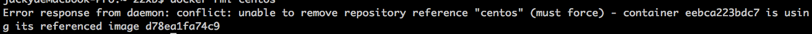

Docker会提示有容器正在运行，无法删除。

如果要强制删除，可以使用-f参数：

```
docker rmi -f centos2
```

但不建议强制删除的方式删除容器依赖的镜像。正确的方式是，先删除依赖该镜像的所有容器，再删除镜像。

可以使用如下命令，删除容器：

```
docker rm [CONTAINER ID]
```

#### 存出和载人镜像

##### 存出镜像

如果要存出镜像到本地文件，可以使用**docker save**命令。

例如：

```
docker save -o centos.tar centos
```

##### 载入镜像

如果要导入镜像到Docker中，可以使用**docker load**

例如：

```
docker load --input centos.tar
```

#### 上传镜像

使用**docker push**命令上传镜像到仓库。默认上传到DockerHub，命令格式如下：

```
docker push NAME[:TAG]
```

第一次使用时，会提示输入登录信息或进行注册。

## 容器
容器是Docker的另外一个核心概念。

简单地说，容器是镜像的一个运行实例，所不同的是，它带有额外的**可写**文件层。

本节将具体介绍容器的重要操作，包括创建一个容器、启动容器、终止一个容器、进入容器内执行操作、删除容器和导入导出容器来实现容器迁移等。

#### 创建容器

Docker的容器十分轻量级，用户可以随时创建或删除容器。

##### 新建容器

可以使用**docker create** 命令新建一个容器，例如：

```
docker create -ti centos
```

使用**docker create** 命令新建的容器处于停止状态，可以使用**docker start**命令启动它。

##### 新建并启动容器

启动容器有两种方式：

* 基于镜像新建一个容器并启动（**docker run**）
* 将在停止状态的容器重新启动（**docker start**）

例如：

```
docker run centos /bin/echo "hello world"
```

如图结果：

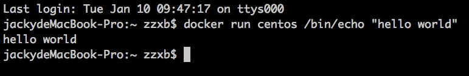

当利用**docker run** 来创建并启动容器时，Docker后台要进行如下过程：

* 检查本地是否存在指定的镜像，不存在就从默认仓库下载。
* 利用镜像创建并启动一个容器。
* 分配一个文件系统，并在只读的镜像层外面挂载一层可读写层。
* 从宿主主机配置的网桥接口中桥接一个虚拟接口到容器中。
* 从地址池配置一个IP地址给容器。
* 执行用户指定的应用程序。
* 执行完毕后容器被终止。

通过**docker ps** 命令可以查看所有运行的容器信息。

```
docker ps
```

结果如图：

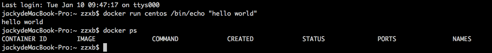

我们可以看出，当执行完“hello world“后，容器着被终止，通过**docker ps** 命令看不到任何运行的容器信息。

通过-a 可以查看存在的容器，包括运行的和终止的容器信息。

```
docker ps -a
```

结果如图：

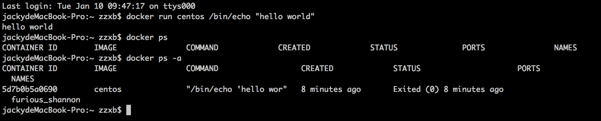

结果信息列如下： 

* CONTAINER ID:容器ID（唯一）
* IMAGE:依赖的镜像
* COMMAND:执行的命令
* STATUS:当前容器的状态
* PORTS：容器端口信息
* NAMES:容器别名（可自定义）

通过结果截图，我们看到了刚刚我们执行的“hello world”容器的信息。目前它的状态是终止。

##### 案例：启动一个bash终端，允许用户进行交互：

```
docker run -t -i centos /bin/bash
```

结果如图：

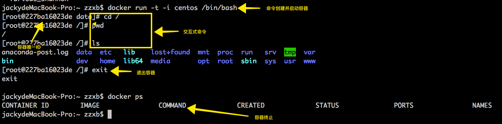

##### 案例2：很多的时候，需要让Docker容器在后台以守护态(Daemonized)形式运行，如下执行命令：

```
docker run -d centos /bin/sh -c "while true; do echo hello world; sleep 1; done"
```

结果如图：

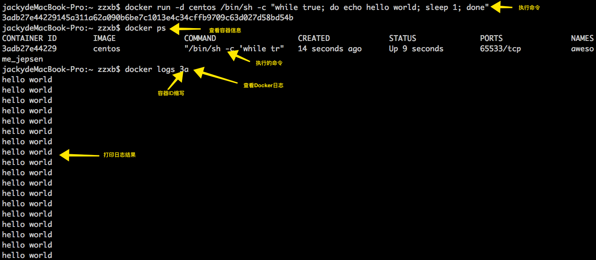

我们可以通过**docker logs [容器ID]**查看容器日志。

```
docker logs 3a
```

#### 进入容器

在使用**-d** 参数时，

docker常用命令

```
# 查看docker的版本信息
$ docker version

# 查看安装docker的信息
$ docker info

# 查看本机Docker中存在哪些镜像
$ docker images

# 检索image
$ docker search ubuntu:14.04

# 在docker中获取ubuntu镜像
$ docker pull ubuntu:14.04

# 显示一个镜像的历史
$ docker history birdben/ubuntu:v1

# 列出一个容器里面被改变的文件或者目
$ docker diff birdben/ubuntu:v1

# 从一个容器中取日志
$ docker logs birdben/ubuntu:v1

# 显示一个运行的容器里面的进程信息
$ docker top birdben/ubuntu:v1

# 从容器里面拷贝文件/目录到本地一个路径
$ docker cp ID:/container_path to_path

# 列出当前所有正在运行的容器
$ docker ps

# 列出所有的容器
$ docker ps -a

# 列出最近一次启动的容器
$ docker ps -l

# 查看容器的相关信息
$ docker inspect $CONTAINER_ID

# 显示容器IP地址和端口号，如果输出是空的说明没有配置IP地址（不同的Docker容器可以通过此IP地址互相访问）
$ docker inspect --format='{{.NetworkSettings.IPAddress}}' $CONTAINER_ID

# 保存对容器的修改 
$ docker commit -m "Added ssh from ubuntu14.04" -a "birdben" 6s56d43f627f3 birdben/ubuntu:v1

# 参数：
# -m参数用来来指定提交的说明信息；
# -a可以指定用户信息的；
# 6s56d43f627f3代表的时容器的id；
# birdben/ubuntu:v1指定目标镜像的用户名、仓库名和 tag 信息。

# 构建一个容器 
$ docker build -t="birdben/ubuntu:v1" .

# 参数：
# -t为构建的镜像制定一个标签，便于记忆/索引等
# . 指定Dockerfile文件在当前目录下，也可以替换为一个具体的 Dockerfile 的路径。

# 在docker中运行ubuntu镜像
$ docker run <相关参数> <镜像 ID> <初始命令>

# 守护模式启动
$ docker run -it ubuntu:14.04

# 交互模式启动
$ docker run -it ubuntu:14.04 /bin/bash

# 指定端口号启动
$ docker run -p 80:80 birdben/ubuntu:v1

# 指定配置启动
$ sudo docker run -d -p 10.211.55.4:9999:22 birdben/ubuntu:v1 '/usr/sbin/sshd' -D

# 参数：
# -d：表示以“守护模式”执行，日志不会出现在输出终端上。
# -i：表示以“交互模式”运行容器，-i 则让容器的标准输入保持打开
# -t：表示容器启动后会进入其命令行，-t 选项让Docker分配一个伪终端（pseudo-tty）并绑定到容器的标准输入上
# -v：表示需要将本地哪个目录挂载到容器中，格式：-v <宿主机目录>:<容器目录>，-v 标记来创建一个数据卷并挂载到容器里。在一次 run 中多次使用可以挂载多个数据卷。
# -p：表示宿主机与容器的端口映射，此时将容器内部的 22 端口映射为宿主机的 9999 端口，这样就向外界暴露了 9999 端口，可通过 Docker 网桥来访问容器内部的 22 端口了。
# 注意：这里使用的是宿主机的 IP 地址：10.211.55.4，与对外暴露的端口号 9999，它映射容器内部的端口号 22。ssh外部需要访问：ssh root@10.211.55.4 -p 9999
# 不一定要使用“镜像 ID”，也可以使用“仓库名:标签名”

# start 启动容器
$ docker start 117843ade696117843ade696
# stop 停止正在运行的容器
$ docker stop 117843ade696117843ade696
# restart 重启容器
$ docker restart 117843ade696117843ade696
# rm 删除容器
$ docker rm 117843ade696117843ade696
# rmi 删除镜像
$ docker rmi ed9c93747fe1Deleted

# 登录Docker Hub中心
$ docker login

# 发布上传image（push）
$ docker push birdben/ubuntu:v1
```

修改密码：

```
echo 'newpassword' |passwd root --stdin
```

映射端口和服务

```
docker run -d -p 8888:22 myssh4:latest /usr/sbin/sshd -D
```

提交修改：

```
docker commit 81041ab6b5f6 myssh4
```

运行：

```
docker run -it 3b5e50532f20 /bin/bash
```

执行容器某个应用：

```
docker exec 81041ab6b5f6 /bin/bash
```

查看当前运行容器列表：

```
docker ps
```

查看所有镜像列表:

```
docker images
```

停止某个容器：

```
docker stop [name/容器id]
```

ssh登录:

```
ssh root@192.168.203.134 -p 8888
```

阿里docker仓库以及加速器:

```
https://cr.console.aliyun.com/
```

删除容器：

```
docker rm [CONTAINER ID(容器id)]
```

删除镜像：

```
docker rmi [IMAGE ID(镜像id)]
```

centos7下安装docker:

```
curl -sSL http://acs-public-mirror.oss-cn-hangzhou.aliyuncs.com/docker-engine/internet | sh -
```

获得镜像：

```
docker pull NAME[:TAG]
```

在aliyun仓库获得镜像：https://dev.aliyun.com

DOCKER容器时区问题解决

```
[root@ab374724d6b0 ~]# rm -rf /etc/localtime 
[root@ab374724d6b0 ~]# ln -s /usr/share/zoneinfo/Asia/Shanghai /etc/localtime
```

Dockerfile中，ADD和COPY都是拷贝本机文件到container制作image。

那么ADD和COPY有什么区别呢？

ADD比COPY多了2个功能：

① ADD 的<src>可以为URL

② ADD 到container的tar文件会被自动解压，并删除原tar文件。


## 编写者

- zzxb


## 版本

V 1.0.0


## 修改日志
- 2016-9-2:
- [x] 初次创建文档
- 2016-9-8：
- [x] 新增了idea中Maven骨架生成慢问题的解决方案

## 参考资源
以下是在编写文档中收集的资源,对深入理解与运用有帮助

- [在Windows下安装Maven](http://jingyan.baidu.com/article/1709ad808ad49f4634c4f00d.html)

- - - -


